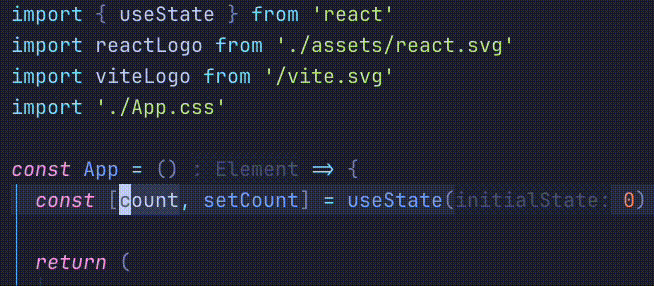

<p align="center">
  <h1 align="center">react.nvim</h2>
</p>

<p align="center">
    Refactoring tools to improve React development experience in Neovim
</p>

<div align="center">
    
</div>

## ⚡️ Features

- **Bidirectional useState renaming**: Renaming state variable automatically updates setter, and vice versa
- **LSP integration**: Works seamlessly with native LSP rename functionality
- **inc-rename.nvim support**: Compatible with interactive renaming workflows
- **Conflict detection**: Prevents naming conflicts before applying renames

## 📋 Installation

<div align="center">
<table>
<thead>
<tr>
<th>Package manager</th>
<th>Snippet</th>
</tr>
</thead>
<tbody>
<tr>
<td>

[wbthomason/packer.nvim](https://github.com/wbthomason/packer.nvim)

</td>
<td>

```lua
-- stable version
use {"react.nvim", tag = "*" }
-- dev version
use {"react.nvim"}
```

</td>
</tr>
<tr>
<td>

[junegunn/vim-plug](https://github.com/junegunn/vim-plug)

</td>
<td>

```lua
-- stable version
Plug "react.nvim", { "tag": "*" }
-- dev version
Plug "react.nvim"
```

</td>
</tr>
<tr>
<td>

[folke/lazy.nvim](https://github.com/folke/lazy.nvim)

</td>
<td>

```lua
-- stable version
return {
    {"react.nvim", version = "*"}
}
-- dev version
return {
    "react.nvim"
}
```

</td>
</tr>
</tbody>
</table>
</div>

## ☄ Getting started

The plugin automatically enables when you open React files (`.jsx`, `.tsx`).

Use your LSP rename function on any useState variable:

**Examples:**
- Rename `count` → `num` automatically updates `setCount` → `setNum`
- Rename `setCount` → `setNum` automatically updates `count` → `num`
- Rename `isOpen` → `isVisible` automatically updates `setIsOpen` → `setIsVisible`
- Rename `setLoading` → `setFetching` automatically updates `loading` → `fetching`

## 🧰 Commands

|      Command      |              Description              |
|-------------------|---------------------------------------|
|     `:React`      |  Toggle plugin enabled/disabled       |
|  `:React status`  |  Check if plugin is enabled           |

## ⌨ Contributing

PRs and issues are always welcome. Make sure to provide as much context as possible when opening one.

